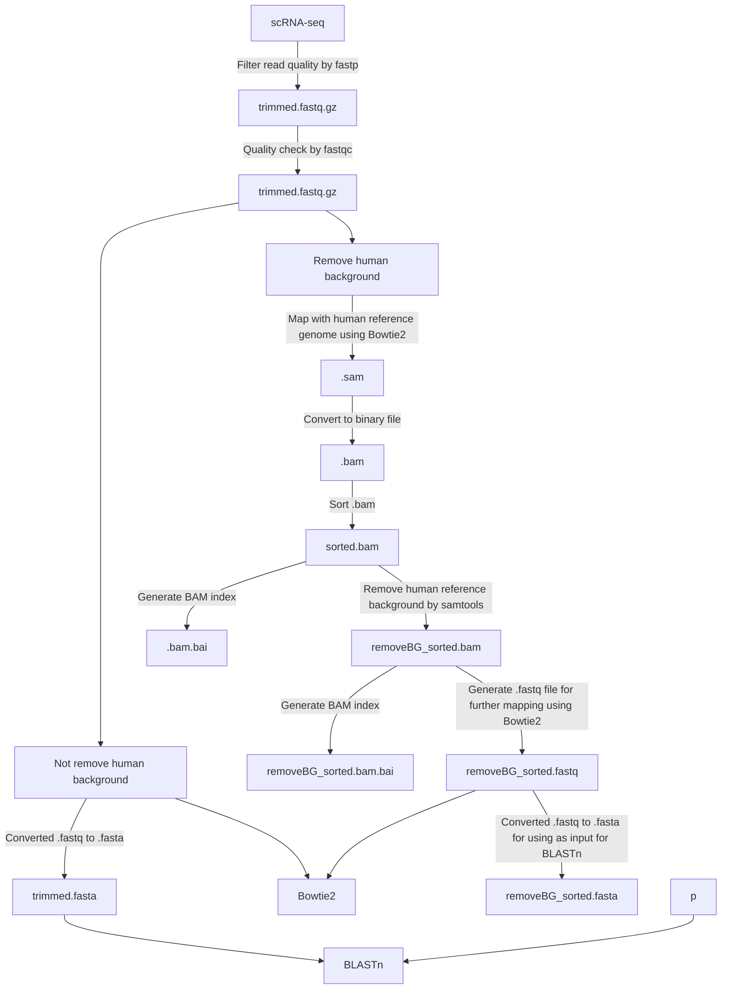

# Human viral detection in scRNA-seq data 
## Human known viruses identification from scRNA-seq data using Bowtie2 and BLASTn
Main focus between BLASTn and Bowtie2 

|             |    BLASTn     |     Bowtie2   |
|-------------| ------------- | ------------- |
| Purpose     | Searching our scRNA-seq reads in known human viruses database to find viral nucleotide sequence similarity | Mapping our scRNA-seq reads to specific viral reference genomes |

## Workflow of our study

Due to scRNA-seq reads are short and easy to loss the information if we filtered out a lot of reads, I decided to do two different ways. 
	- 1.) I mapped scRNA-seq data with human reference genome to remove human background (only remains expected viral sequence reads) in case the scRNA-seq contaminated human reference sequence due to sampling. 
 	- 2.) After processed read quality filtering, I directly search the sequence reads using **BLASTn** or map with viral reference sequences using **Bowtie2** for viral sequence detection




## Dependencies
- Docker
- Anaconda
- Entrez Direct
```
sh -c "$(wget -q https://ftp.ncbi.nlm.nih.gov/entrez/entrezdirect/install-edirect.sh -O -)"
echo "export PATH=\$HOME/edirect:\$PATH" >> $HOME/.bash_profile
```
- Blast
```
wget  https://ftp.ncbi.nlm.nih.gov/blast/executables/blast+/LATEST/ncbi-blast-2.15.0+-x64-linux.tar.gz
tar -xvzf ncbi-blast-2.15.0+-x64-linux.tar.gz
mv ncbi-blast-2.15.0+ blast
export PATH=/path/to/directory/blast/bin:$PATH
```
- fastp
```
docker pull quay.io/biocontainers/fastp:0.23.4--hadf994f_2
```
- fastqc
```
docker pull quay.io/biocontainers/fastqc:0.12.1--hdfd78af_0
```
- bowtie2
```
docker pull quay.io/biocontainers/bowtie2:2.5.3--py310ha0a81b8_0
```
- samtools
```
docker pull quay.io/biocontainers/samtools:1.19.2--h50ea8bc_0
```
- seqtk
```
docker pull quay.io/biocontainers/seqtk:1.4--he4a0461_1
```

## Pre-processing step: [[For Bowtie2]] Retrieving reference genome and generating index files 
Before mapping our scRNA-seq data with reference sequences, we need to prepare index files of reference genomes. (We will contain these index names into array name `viral_reference_genome_array` in the script `run_bowtie2_blastn.sh`)
We need to prepare index files of 
	- `1) Human reference genome` for the process of removing human genome background from our scRNA seq data
	- `2) Viral reference genome` we interested, in order to identify whether interested viral sequences are in our scRNA-seq data or not

### - Retreive human reference genome from NCBI
```
curl https://api.ncbi.nlm.nih.gov/datasets/v2alpha/genome/accession/GCF_000001405.40/download?include_annotation_type=GENOME_FASTA,GENOME_GFF --output hg38.zip
unzip hg38.zip
cd /ncbi_dataset/data/GCF_000001405.40 
mv GCF_000001405.40_GRCh38.p14_genomic.fna hg38.fna
```
### - or Retreive human reference genome by using `efetch ` command of Entrez ID tool *We need to know accession number of the reference genome*
```
efetch -db nuccore -id NC_000001.11 -format fasta > hg38.fasta
```

### - Retreive specific viral reference genome from NCBI using `efetch ` command of Entrez ID tool , *Note:We need to know accession number of the reference genome*
e.g.
```
#Cytomegalovirus complete genome (Human betaherpesvirus 5)
efetch -db nuccore -id NC_006273.2 -format fasta > cmv.fasta

# Epstein-barr virus complete genome (Human gammaherpesvirus 4)
efetch -db nuccore -id NC_007605.1 -format fasta > ebv.fasta

#Vericell-zoster virus complete genome (Human alphaherpesvirus 3)
efetch -db nuccore -id NC_001348.1 -format fasta > vzv.fasta
```

### - After we retreived specific reference genomes (contains in same directory), we will generate index files in order to map with our scRNA-seq with Bowtie2 `bowtie2-build` command
```
#Generating index file of Human reference genome
docker run --rm --user $(id -u):$(id -g) -v `pwd`:`pwd` -w `pwd` quay.io/biocontainers/bowtie2:2.5.2--py39h6fed5c7_0 bowtie2-build -f hg38.fasta hg38

#Generating index file of interested viral reference genome (e.g. we interested in Cytomegalovirus, Epstein-barr virus, Vericello-zoster virus)
docker run --rm --user $(id -u):$(id -g) -v `pwd`:`pwd` -w `pwd` quay.io/biocontainers/bowtie2:2.5.2--py39h6fed5c7_0 bowtie2-build -f cmv.fasta cmv       # → Cytomegalovirus(CMV)
docker run --rm --user $(id -u):$(id -g) -v `pwd`:`pwd` -w `pwd` quay.io/biocontainers/bowtie2:2.5.2--py39h6fed5c7_0 bowtie2-build -f ebv.fasta ebv       # → Epstein-barr virus (EBV)
docker run --rm --user $(id -u):$(id -g) -v `pwd`:`pwd` -w `pwd` quay.io/biocontainers/bowtie2:2.5.2--py39h6fed5c7_0 bowtie2-build -f vzv.fasta vzv       # → Vericello-zoster virus (VZV)
```

We aimed to identify all known human viruses in the database, so we try to get the list of viral accession number from NCBI from the all known human viruses report (In this study, we got the report in table from ViralZone website)
## Pre-processing step: Download all known human viruses data from `ViralZone` 
```
wget https://viralzone.expasy.org/resources/Table_human_viruses.txt?
```

### - Generate list of `efetch` commands (to retreive .fasta from NCBI) into bash script
```
conda create -n r_env r-essentials r-base
conda activate r_env
chmod 777 create_fetch.R
Rscript create_fetch.R
```
### - Run bash script to fetch all known human viruses .fasta files 
```
chmod 777 run_efetch.sh
nohup ./run_efetch.sh > run_efecth.out
```
After running `run_efetch.sh`, we will obtain all known human virus genomes in `.fasta` file in our directory. Due to we tried to fetch all possible existed version of complete genome by accession number, so we may gain non-existed version of complete genome with no information inside the file. Because of this, we need to remove all files that have no sequence information.
```
#Find all file in directory that has no second line then remove !
find . -type f -exec awk -v x=2 'NR==x{exit 1}' {} \; -exec rm -f {} \;
```
So now, inside our directory will only remain `.fasta` file with sequence information.
Next, we aimed to generate single `.fasta` file which contains all known human virus genome sequences `all_human_viruses.fasta`
```
cat NC*.fasta > all_human_viruses.fasta
mkdir nc_pulls
mv NC*.fasta nc_pulls #move all .fasta files to new directory
cp all_human_viruses.fasta nc_pulls
```
Last step, we will run bash script which `all_human_viruses.fasta` is the input data for running BLASTn while Bowtie2 will use array of viral reference genome as input (we need to change index name inside the script)

Here is the bash script for running both bowtie2 and blastn together in single run  **Note: Inside the script, there are some steps with the comment `#`, some may already process outside the script, the file name for each loop, and the path working directory you need to modify by yourself. Depends on your data**
```
chmod 777 run_bowtie2_blastn.sh
nohup ./run_bowtie2_blastn.sh > run_bowtie2_blastn.out
```
In case, we need to run only BLASTn separeately

```
chmod 777 only_blastn.sh
nohup ./only_blastn.sh > only_blastn.out
```

## 4.) Obtain file of matched human viruses `exp. human_viruses_detected_scRNA.txt`


## Output
### Pre-processing step 
First input: Raw .fastq.gz file
- Raw .fastq.gz file
	- trimmed.fastq.gz
		- .sam
			- .bam
				- Sorted.bam
					 - removeBG_sorted.bam
						- unmapped_reads.bam
							- unmapped_reads.bam.bai
								- _**unmapped_reads.fastq**_
									- _** unmapped_reads.fasta**_ 
  

**Output for the next process**

Input using with **_BLASTn_** for nucleotide similarity seacrhing: **unmapped_reads.fasta**

Input using with **_Bowtie2_** for mapping with reference genome: **unmapped_reads.fastq**


Reference: https://github.com/caleblareau/serratus-reactivation-screen/tree/main/serratus_data_setup
